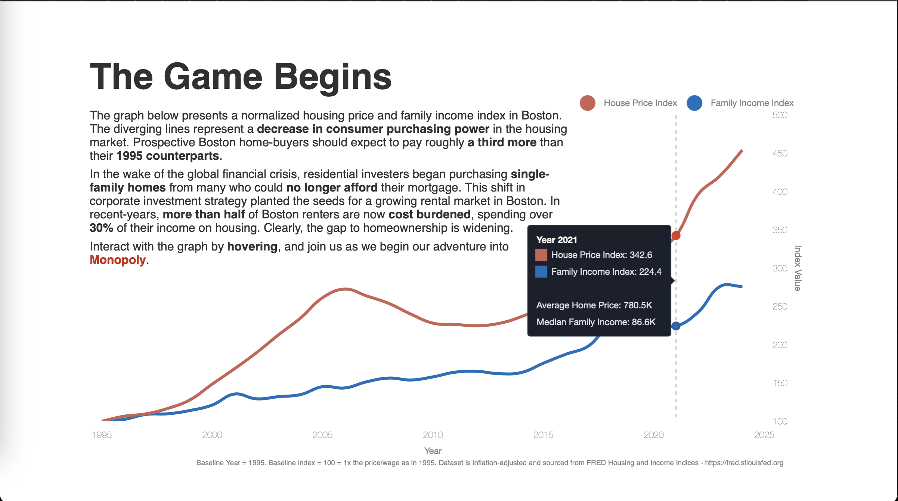
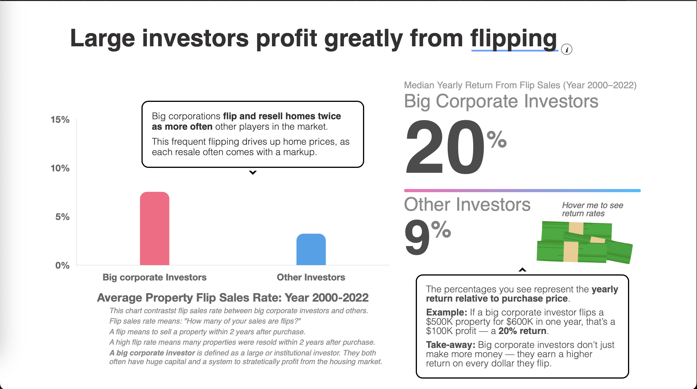

# Robber Barons
A mnopoly-themed web interface for visualizing Boston institutional investors's gains and control over Boston real estates. Built with Typescript, the Svelte UI framework, and vercel for deployment.

Website: [Robber Barons](https://robber-barons.vercel.app)

# Example pages

    
    
    
    
    

# Note
This repository is for demo only. All proprietary data was removed before git repo creation. Typically, you would run  `pnpm install` to install dependencies then  `pnpm dev` to run it locally.